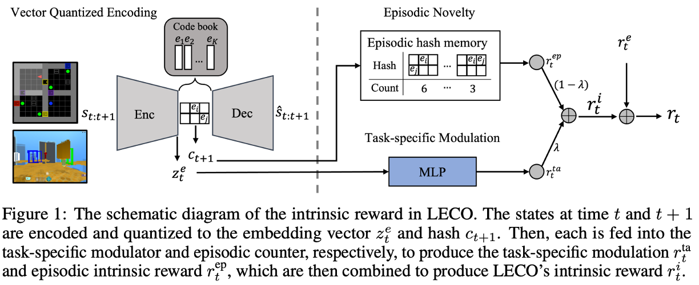

[](http://kakaobrain.com/)
[](https://proceedings.neurips.cc/paper_files/paper/2022)

# LECO: Learnable Episodic Count (NeurIPS 2022)
This is an official implementation of **LECO: Learnable Episodic Count for Task-Specific Intrinsic Reward** [[arxiv]](https://arxiv.org/abs/2210.05409)

<p align="center">
    
</p>

This repo is extended from the original [Sample Factory](https://github.com/alex-petrenko/sample-factory) by Aleksei Petrenko et al. 


## Requirements
- torch==1.9.0
- gym-minigrid==1.0.3
- deepmind-lab @ file:///tmp/dmlab_pkg/deepmind_lab-1.0-py3-none-any.whl


## Training Scripts
### Example command for DMLab task
Two nodes with 4 V100 gpus on each node
```angular2html
python -m dist.launch --nnodes=2 --node_rank=0 --nproc_per_node=4 --master_addr=$MASTER_ADDR -m sample_factory.algorithms.appo.train_appo --cfg=lstm_dmlab_single_leco --train_dir=/your/train/directory --experiment=your_experiment_name
python -m dist.launch --nnodes=2 --node_rank=1 --nproc_per_node=4 --master_addr=$MASTER_ADDR -m sample_factory.algorithms.appo.train_appo --cfg=lstm_dmlab_single_leco --train_dir=/your/train/directory --experiment=your_experiment_name
```

### Example command for MiniGrid task
Single node with 2 V100 gpus
```angular2html
python -m dist.launch --nnodes=1 --node_rank=0 --nproc_per_node=2 --master_addr=$MASTER_ADDR -m sample_factory.algorithms.appo.train_appo --cfg=lstm_MiniGrid-ObstructedMaze-Full_leco --train_dir=/your/train/directory --experiment=your_experiment_name
```

## Citation

```
@inproceedings{jo2022leco,
 author = {Jo, Daejin and Kim, Sungwoong  and Nam, Daniel and Kwon, Taehwan and Rho, Seungeun and Kim, Jongmin and Lee, Donghoon},
 booktitle = {Advances in Neural Information Processing Systems},
 editor = {S. Koyejo and S. Mohamed and A. Agarwal and D. Belgrave and K. Cho and A. Oh},
 pages = {30432--30445},
 publisher = {Curran Associates, Inc.},
 title = {LECO: Learnable Episodic Count for Task-Specific Intrinsic Reward},
 url = {https://proceedings.neurips.cc/paper_files/paper/2022/file/c43b2989b1ba055aa713a4abbe4a8b05-Paper-Conference.pdf},
 volume = {35},
 year = {2022}
}
```

## Contact

Daejin Jo, [daejin.jo@kakaobrain.com](daejin.jo@kakaobrain.com)  
Daniel Wontae Nam, [dwtnam@kakaobrain.com](dwtnam@kakaobrain.com)  